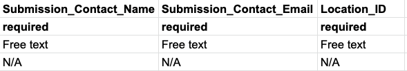

# Location metadata instructions

The locations metadata reporting format is intended to help researchers compile a minimal set of metadata about point locations.

To begin using the format, we recommend that users first read through the reporting format’s [terminology guide](guide.md). The guide provides names, definitions, applicable units, and examples for each reporting format element that you will find in the reporting format templates.

After reviewing the guide, download a blank copy of the reporting format template. While you can choose to either download a CSV or Excel compatible version of the template, when uploading to ESS-DIVE, **we require that completed location metadata are uploaded in the non-proprietary CSV format**.

The template includes both required (e.g., `Submission_Contact_Name`) and optional (e.g., `Location_Alias`) fields for you to complete. You are only required to fill out the first 6 elements pictured below. These are also listed as required fields in our guide.

Once you have filled out the location reporting format template, please delete the first row (which simply provides instructions for filling out the template) as well as the 6th row, and the first column so that your filled out template looks like the one pictured below.

As you begin to use the reporting format, we encourage you to submit any suggestions you have for improving the template, instructions, or any other repository content via a [GitHub issue](https://github.com/ess-dive-community/essdive-location-metadata/issues/new/choose).

